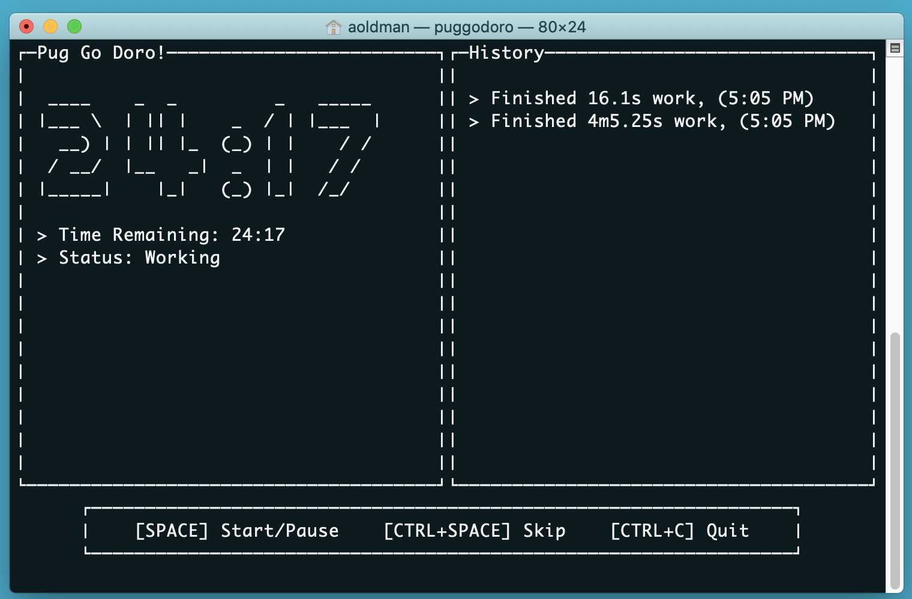

# Pug Go Doro

_Pug Go Doro_ is a pomodoro-style timer designed to be used at the terminal.

## Installation

Do `go install github.com/Arizard/pug-go-doro`. If your `$GOBIN` is included in
your `PATH` then you can type `puggodoro` at the shell prompt.

## Packages Used

* [go-figure](https://github.com/common-nighthawk/go-figure)
* [gocui](https://github.com/jroimartin/gocui)
* [notify](https://github.com/martinlindhe/notify)
